## Mobile 4 - The Winner of SecGuy 888
#### Description
Get the jackpot with the slot.  
  
__Flag format__ : WTCTT2023_MOB04{[a-z0-9]{32}}  
__File__ : sh.sth.secguy888.apk 
__SHA256 Checksum__ : 450c8abb1ec0b4ffc18f4c3992007738c8439e8d8d6a6d22a3e8ebbed0d827cf

#### Solution
See In code, we will find api path that we can use to spin slot but we don't know how much of balance.
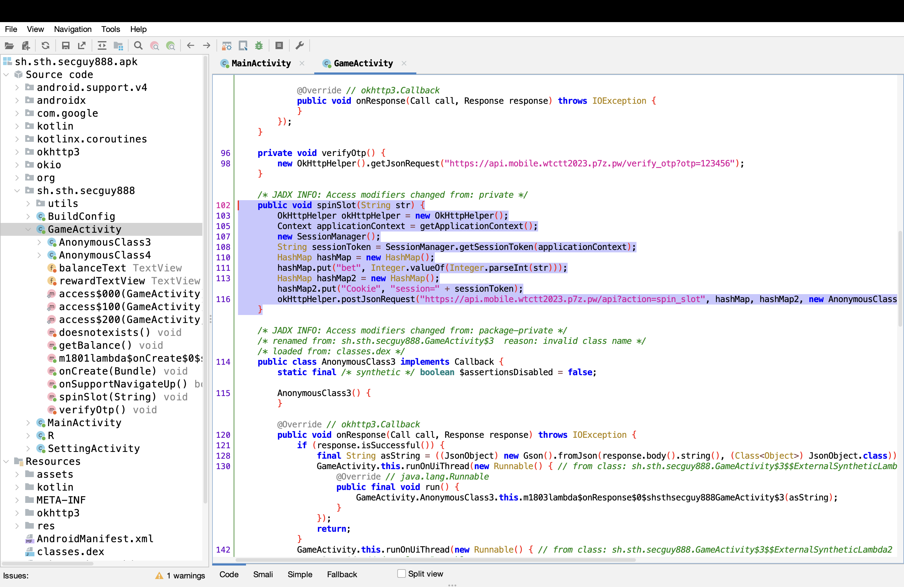

I found getBalance() now use it to see my balance.

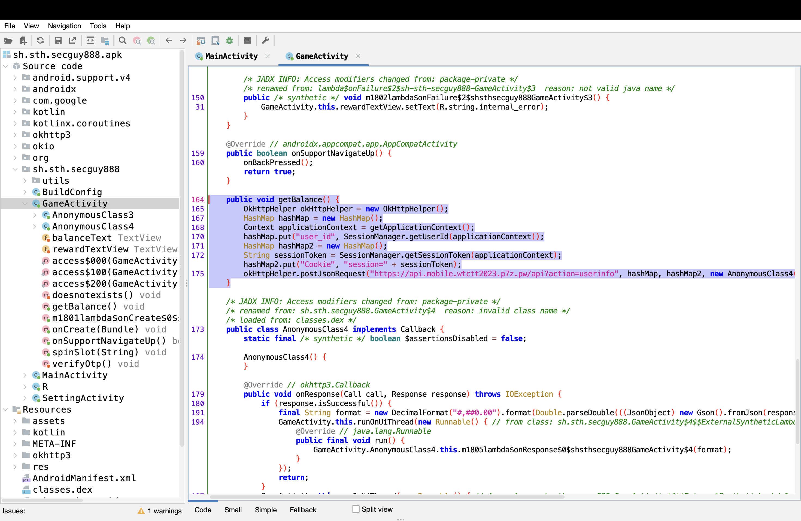

Generate POST API by yourself if you can't I think skill issue!!  Just Kidding

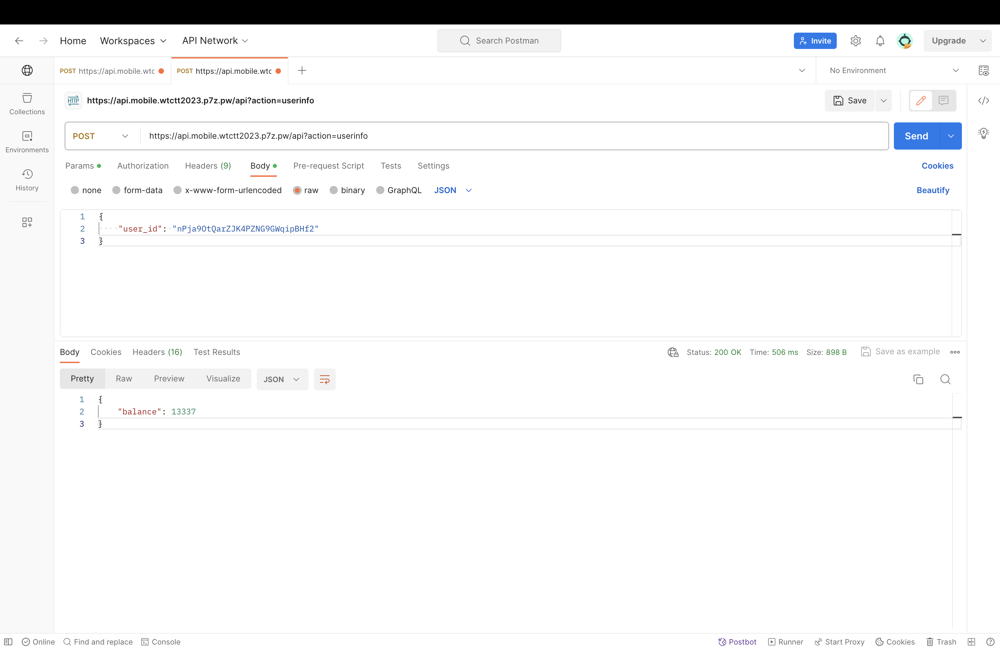

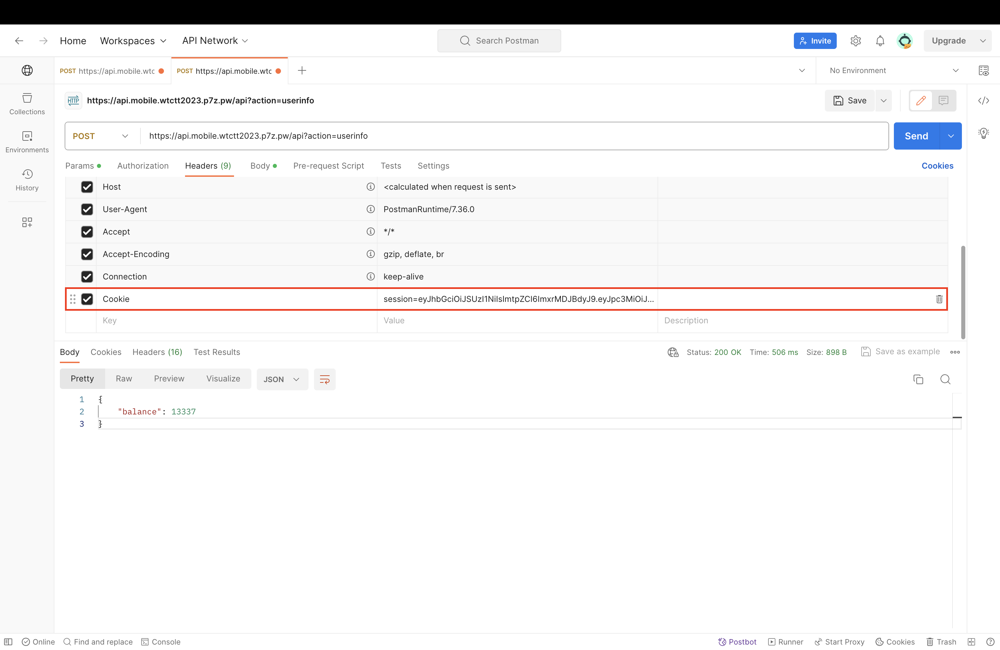

If you see in code you will find this function that told you about API is debug mode.

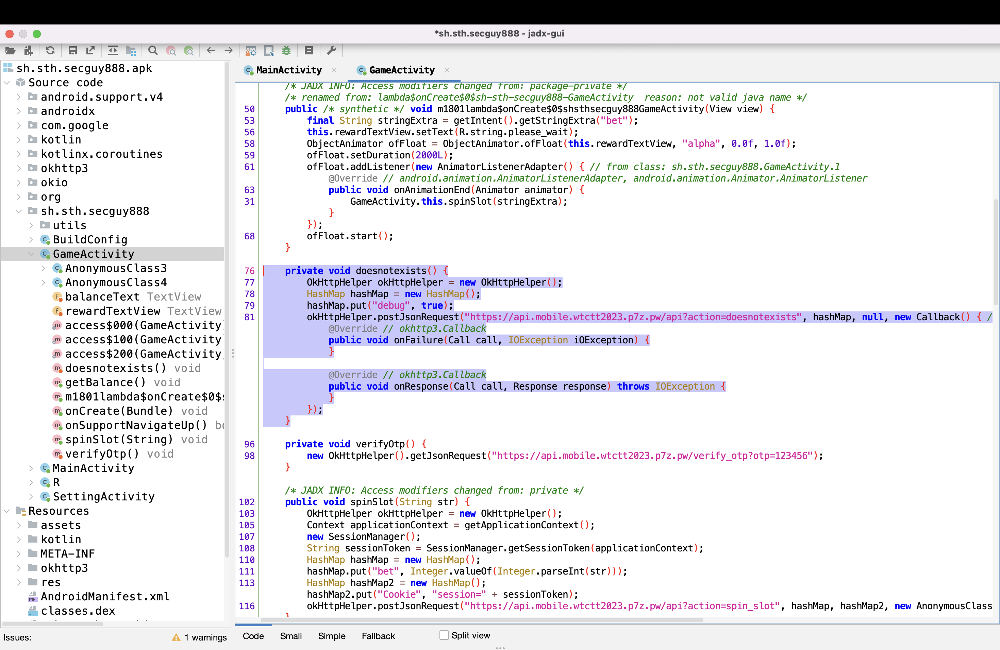

Craft API for spin slot. After spin without debug key in body, I got no reward

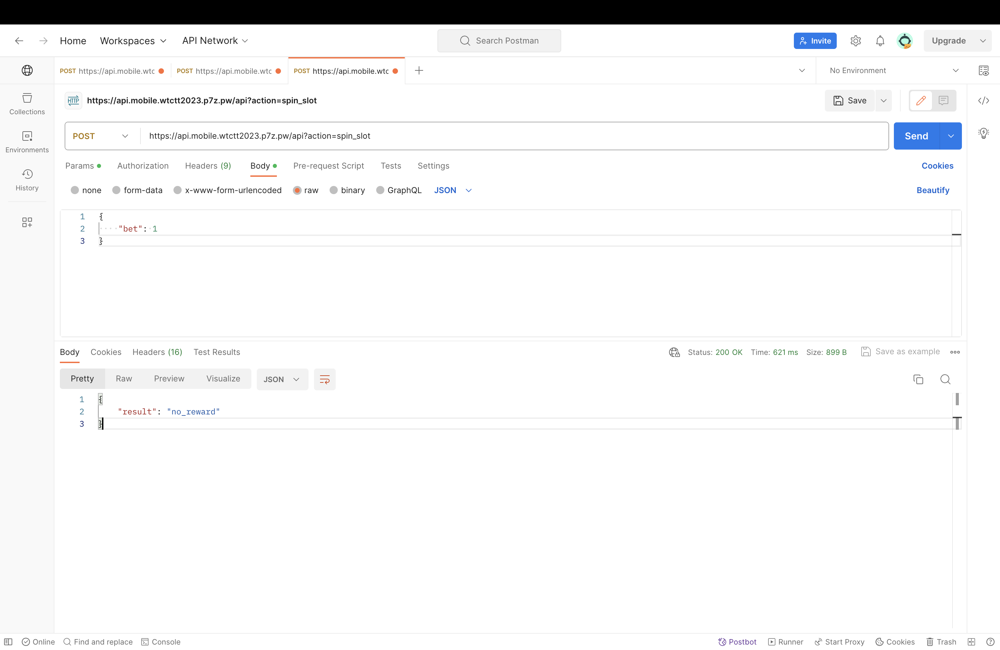

Put debug key in body. I got hidden_action, Let's use it.

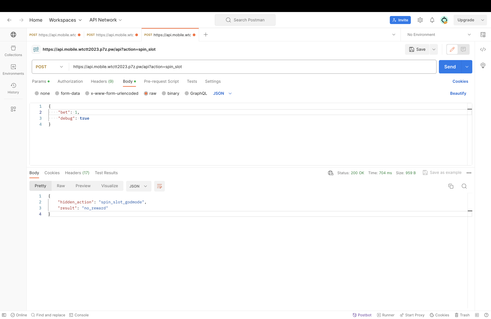

Result was told you about your balance is not sufficient. it's require 31337.

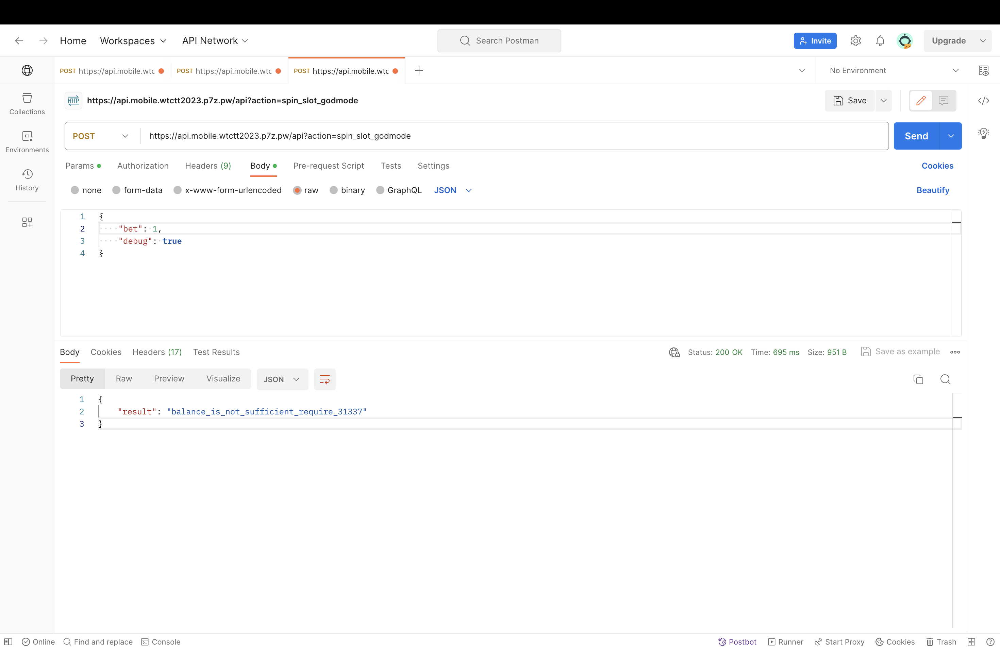

After a bit of thought, it got to me that if I transmit the bet in minus digits, the API will update the amount to something like your balance -(- bet). Remember spin_slot mode !!!!

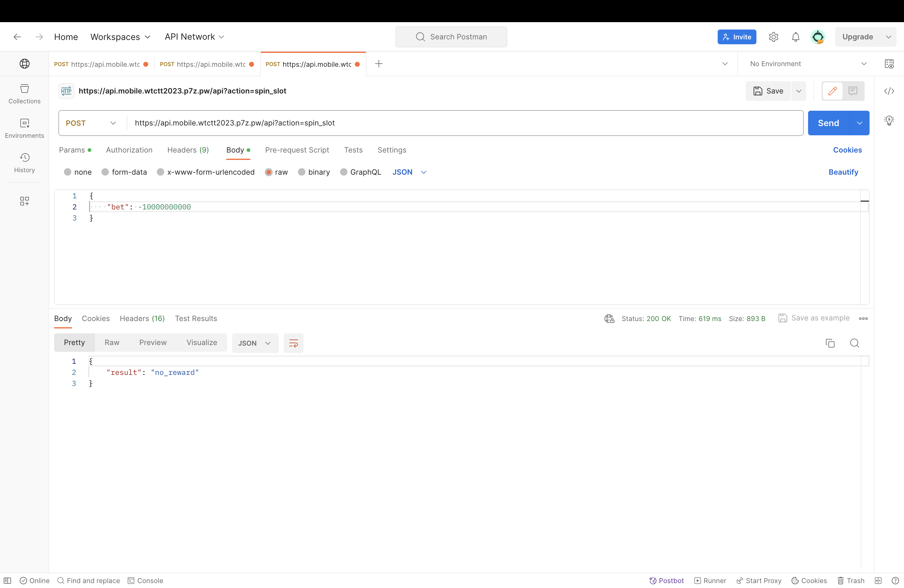

My balance is 99999

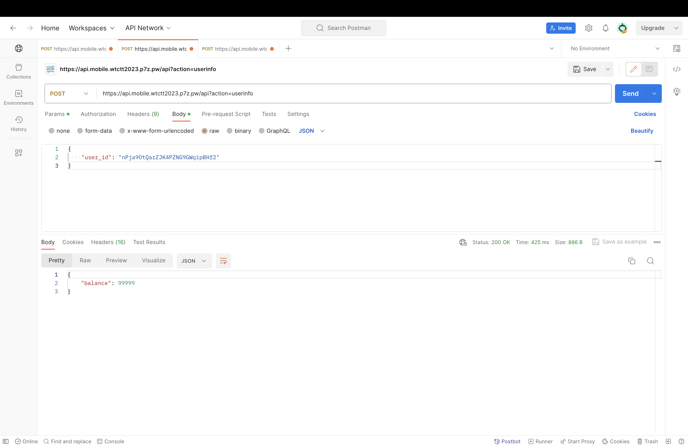

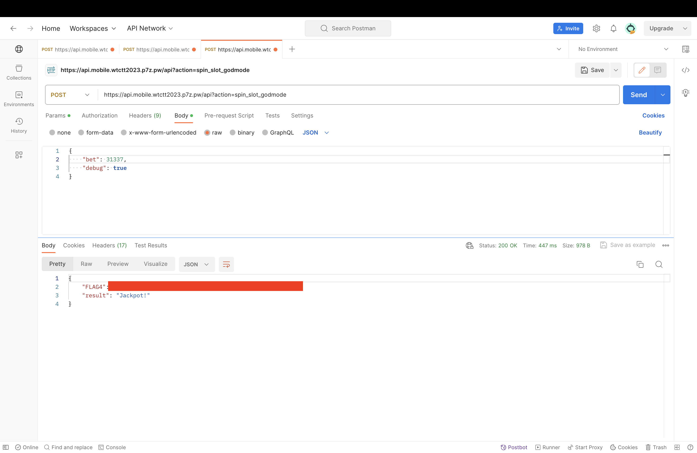

Yummy, we got FLAG4. XD!!!