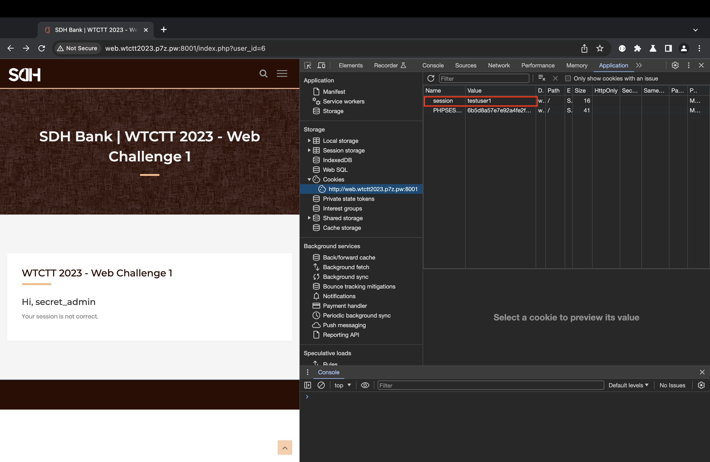

## Web 1 - Account Takeover
#### Description
Take over an admin account with Insecure Direct Object Reference (IDOR) vulnerabilities.  
  
__Flag Format__ : WTCTT2023_WEB01{[a-z0-9]{32}}  
__URL__ : [http://web.wtctt2023.p7z.pw:8001/](http://web.wtctt2023.p7z.pw:8001/)  
  
Hint 1: Directory Fuzzing is NOT required (no hidden files / web pages).  
Hint 2: Online password brute forcing (dictionary attack) is NOT required.  
Hint 3: The challenge is designed to be exploited manually without automated security scanners.

#### Solution

Just open dev tools and I found credential that comment in HTML

After Login I see in url and I found user_id=1, Let's try to change it because in description is told you about vulnerable is IDOR.

Administrator account is secret_admin but response show you about session is wrong that make me to use dev tool to edit my session follow by username. 

Yummy, got FLAG1. XD!!!